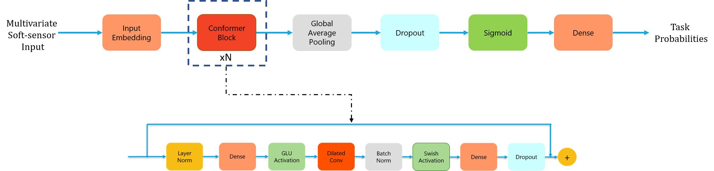

# Soft-Sensing ConFormer: A Curriculum Learning-based Convolutional Transformer.
by Jaswanth Yella, Chao Zhang, Yu Huang, Xiaoye Qian, Sergei Petrov, Ali A. Minai, Sthitie Bom

## Abstract
Over the last few decades, modern industrial processes have investigated several cost-effective methodologies to improve the productivity and yield of semiconductor manufacturing. While playing an essential role in facilitating real-time monitoring and control, the data-driven soft-sensors in industries have provided a competitive edge when augmented with deep learning approaches for wafer fault-diagnostics. Despite the success of deep learning methods across various domains, they tend to suffer with bad performance on multi-variate soft-sensing data domain. To this effect, we propose soft-sensing ConFormer (CONvolutional transFORMER) for wafer fault-diagnostic classification task which primarily consists of multi-head convolution modules that reaps the benefits of fast and light-weight operations of convolutions, and also the ability to learn the robust representations through multi-head design alike transformers. However, another key issue is that traditional learning paradigms tend suffer from performance issues with a noisy and highly-imbalanced soft-sensing data. To address this, we augment our soft-sensing ConFormer model with curriculum learning based loss function, which effectively learns easy samples in the early phase of training and difficult ones later. To further demonstrate the utility of our proposed architecture, we performed extensive experiments on various toolsets of Seagate Technology's wafer manufacturing process which are shared openly along with this work. To the best of our knowledge, this is the first time that curriculum learning-based soft-sensing ConFormer architecture has been proposed for soft-sensing data and our results show strong promise for future extensibility of soft-sensing research domain.

## Acknowledgments
The authors would like to thank Seagate Technology for the support on this study, in particular Tri, Swee, Chon Hui, Yu Yang, Qiao Gu for inspiring discussions, and Muhammad for open sourcing the data sets and the code.

